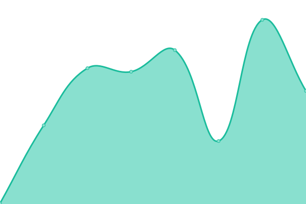
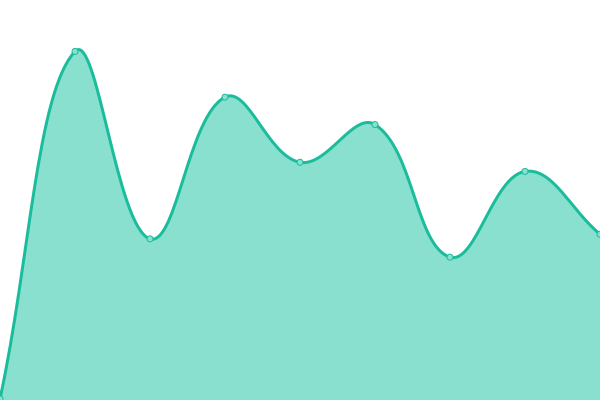
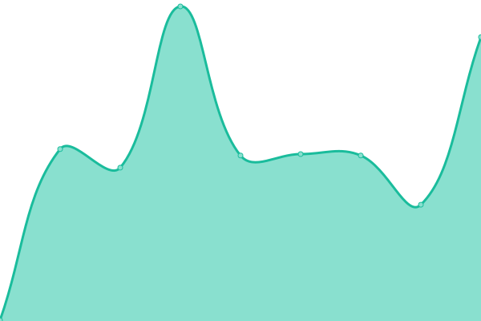

# [📈 Live Status](https://venkat-enable.github.io/upptime): <!--live status--> **🟧 Partial outage**

This repository contains the Enable uptime monitor and status page for [Venkata reddy](https://venkat-enable.github.io/uptime),

With [Upptime](https://upptime.js.org), you can get your own unlimited and free uptime monitor and status page, powered entirely by a GitHub repository. We use [Issues](https://github.com/venkat-enable/upptime/issues) as incident reports, [Actions](https://github.com/venkat-enable/uptime/actions) as uptime monitors, and [Pages](https://venkat-enable.github.io/upptime) for the status page.

<!--start: status pages-->
<!-- This summary is generated by Upptime (https://github.com/upptime/upptime) -->
<!-- Do not edit this manually, your changes will be overwritten -->
<!-- prettier-ignore -->
| URL | Status | History | Response Time | Uptime |
| --- | ------ | ------- | ------------- | ------ |
|  [Google](https://www.google.com) | 🟩 Up | [google.yml](https://github.com/venkat-enable/uptime/commits/HEAD/history/google.yml) | 

 89ms
     
 | 

<a href="https://venkat-enable.github.io/uptime/history/google">100.00%</a>
    

|  [cd](https://cd.enable-technologies.io) | 🟩 Up | [cd.yml](https://github.com/venkat-enable/uptime/commits/HEAD/history/cd.yml) | 

 251ms
     
 | 

<a href="https://venkat-enable.github.io/uptime/history/cd">100.00%</a>
    

|  [ci](https://ci.enable-technologies.io) | 🟥 Down | [ci.yml](https://github.com/venkat-enable/uptime/commits/HEAD/history/ci.yml) | 

 256ms
     
 | 

<a href="https://venkat-enable.github.io/uptime/history/ci">0.00%</a>
    

|  [cics](https://cics.enable-technologies.io) | 🟥 Down | [cics.yml](https://github.com/venkat-enable/uptime/commits/HEAD/history/cics.yml) | 

 271ms
     
 | 

<a href="https://venkat-enable.github.io/uptime/history/cics">0.00%</a>
    

|  [trial01](https://enable-trial01.enable-technologies.app/api/subscription-manager/diagnostics/ping) | 🟥 Down | [trial01.yml](https://github.com/venkat-enable/uptime/commits/HEAD/history/trial01.yml) | 

 212ms
     
 | 

<a href="https://venkat-enable.github.io/uptime/history/trial01">99.99%</a>
    

|  [dev01](https://enable-dev01.enable-technologies.app/admin/api/subscription-manager/diagnostics/ping) | 🟩 Up | [dev01.yml](https://github.com/venkat-enable/uptime/commits/HEAD/history/dev01.yml) | 

 251ms
     
 | 

<a href="https://venkat-enable.github.io/uptime/history/dev01">100.00%</a>
    

|  [qa01](https://enable-qa01.enable-technologies.app/admin/api/subscription-manager/diagnostics/ping) | 🟩 Up | [qa01.yml](https://github.com/venkat-enable/uptime/commits/HEAD/history/qa01.yml) | 

 345ms
     
 | 

<a href="https://venkat-enable.github.io/uptime/history/qa01">100.00%</a>
    

<!--end: status pages-->

[**Visit our status website →**](https://venkat-enable.github.io/uptime)
