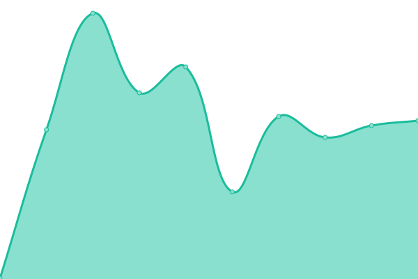
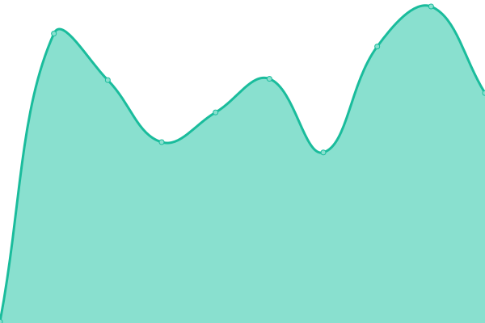
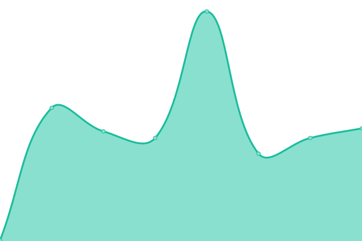

# [📈 Live Status](https://venkat-enable.github.io/upptime): <!--live status--> **🟧 Partial outage**

This repository contains the Enable uptime monitor and status page for [Venkata reddy](https://venkat-enable.github.io/uptime),

With [Upptime](https://upptime.js.org), you can get your own unlimited and free uptime monitor and status page, powered entirely by a GitHub repository. We use [Issues](https://github.com/venkat-enable/upptime/issues) as incident reports, [Actions](https://github.com/venkat-enable/uptime/actions) as uptime monitors, and [Pages](https://venkat-enable.github.io/upptime) for the status page.

<!--start: status pages-->
<!-- This summary is generated by Upptime (https://github.com/upptime/upptime) -->
<!-- Do not edit this manually, your changes will be overwritten -->
<!-- prettier-ignore -->
| URL | Status | History | Response Time | Uptime |
| --- | ------ | ------- | ------------- | ------ |
|  [cd](https://cd.enable-technologies.io) | 🟩 Up | [cd.yml](https://github.com/venkat-enable/uptime/commits/HEAD/history/cd.yml) | 

 218ms
     
 | 

<a href="https://venkat-enable.github.io/uptime/history/cd">100.00%</a>
    

|  [ci](https://ci.enable-technologies.io) | 🟥 Down | [ci.yml](https://github.com/venkat-enable/uptime/commits/HEAD/history/ci.yml) | 

 217ms
     
 | 

<a href="https://venkat-enable.github.io/uptime/history/ci">0.00%</a>
    

|  [cics](https://cics.enable-technologies.io) | 🟥 Down | [cics.yml](https://github.com/venkat-enable/uptime/commits/HEAD/history/cics.yml) | 

 205ms
     
 | 

<a href="https://venkat-enable.github.io/uptime/history/cics">0.00%</a>
    

|  [subscription](https://enable-trial01.enable-technologies.app/api/subscription/diagnostics/ping) | 🟩 Up | [subscription.yml](https://github.com/venkat-enable/uptime/commits/HEAD/history/subscription.yml) | 

 173ms
     
 | 

<a href="https://venkat-enable.github.io/uptime/history/subscription">100.00%</a>
    

|  [party](https://enable-dev01.enable-technologies.app/admin/api/party/diagnostics/ping) | 🟩 Up | [party.yml](https://github.com/venkat-enable/uptime/commits/HEAD/history/party.yml) | 

 244ms
     
 | 

<a href="https://venkat-enable.github.io/uptime/history/party">100.00%</a>
    

|  [content](https://enable-qa01.enable-technologies.app/admin/api/content/diagnostics/ping) | 🟩 Up | [content.yml](https://github.com/venkat-enable/uptime/commits/HEAD/history/content.yml) | 

 185ms
     
 | 

<a href="https://venkat-enable.github.io/uptime/history/content">100.00%</a>
    

<!--end: status pages-->

[**Visit our status website →**](https://venkat-enable.github.io/uptime)
